# CampusFix AI

> Turning student complaints into actionable campus intelligence.

CampusFix AI is an AI-powered campus issue reporting platform. Students can raise and track complaints, while Gemini helps classify complaints, summarize issues, analyze evidence, identify similar complaints, cluster recurring issues, and support administrators with insights grounded in live MySQL data.

<p align="center">
  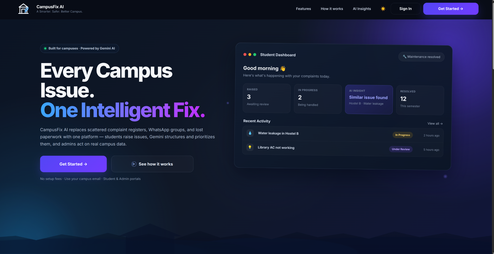
</p>

---

## Overview

Campus complaint handling often becomes difficult when requests are scattered across messages, registers, or informal channels.

CampusFix AI brings the complete workflow into one platform with role-based access, complaint tracking, evidence uploads, notifications, analytics, feedback, secure account recovery, and AI-assisted complaint analysis.

The goal is to move campus issue management from **reactive complaint handling to proactive campus intelligence**.

---

## Highlights

- Student and Admin role-based dashboards
- Complaint creation, editing, deletion, tracking, and history
- Evidence image uploads
- Department assignment and reassignment
- Status updates and administrator notes
- Due dates, overdue tracking, and escalation indicators
- Notifications
- Complaint analytics and feedback insights
- OTP-based password recovery
- Security-focused API and upload validation
- Gemini AI complaint analysis before submission
- Gemini image analysis for evidence photos
- Similar / duplicate complaint detection
- AI Issue Clustering for grouping related unresolved complaints
- AI Campus Insights for administrators
- AI recommendations grounded in real complaint data

---

## Screenshots

### Landing Page

<p align="center">
  
</p>

### Login

<p align="center">
  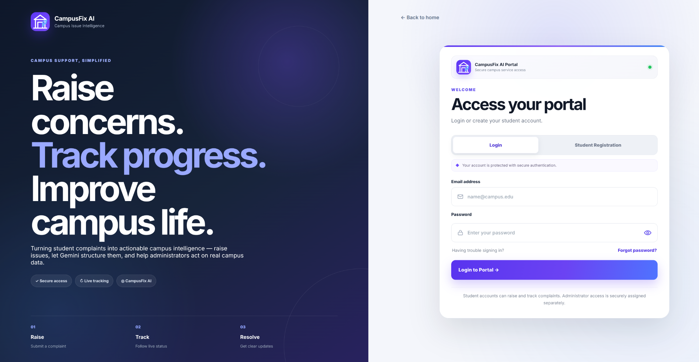
</p>

### Student Dashboard

<p align="center">
  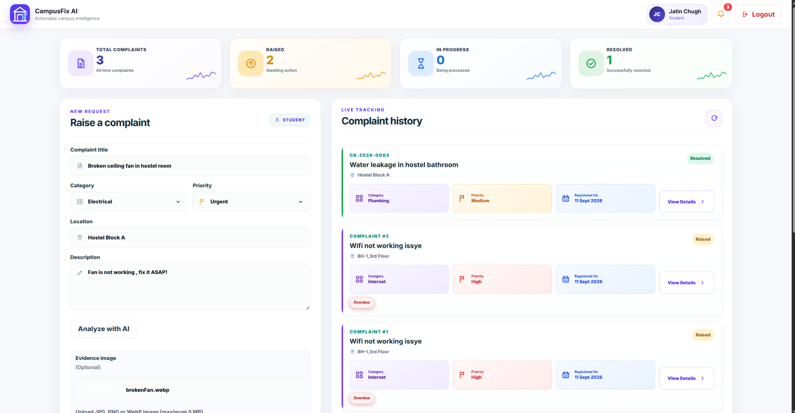
</p>

### Complaint Details

<p align="center">
  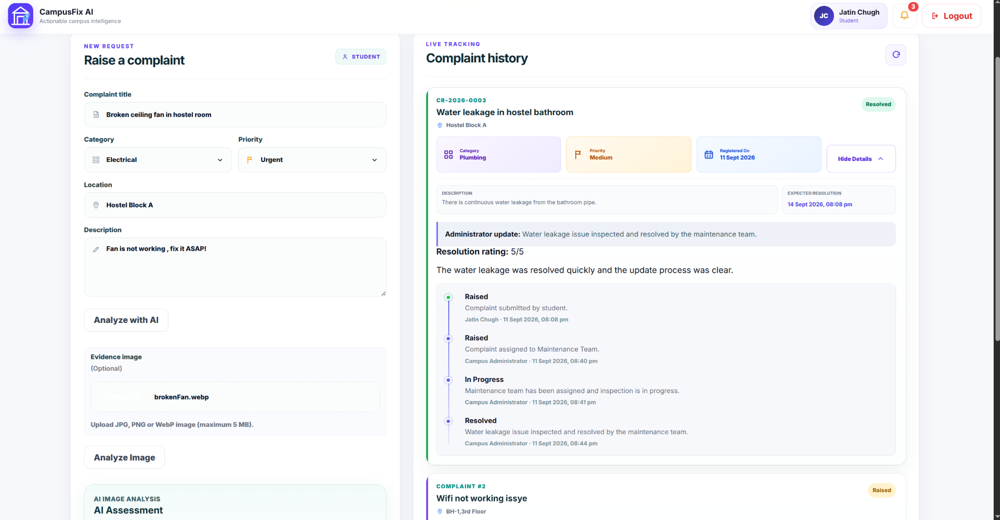
</p>


### Admin Dashboard

<p align="center">
  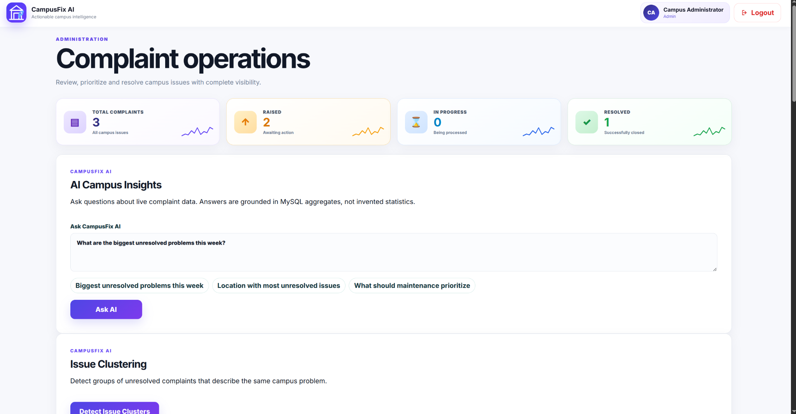
</p>

### Complaint Management

<p align="center">
  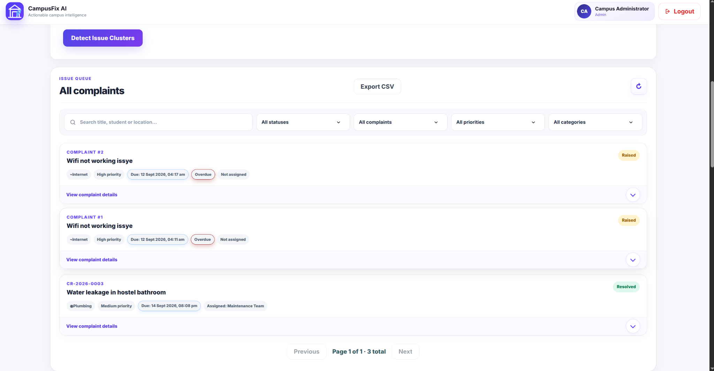
</p>

### Analytics

<p align="center">
  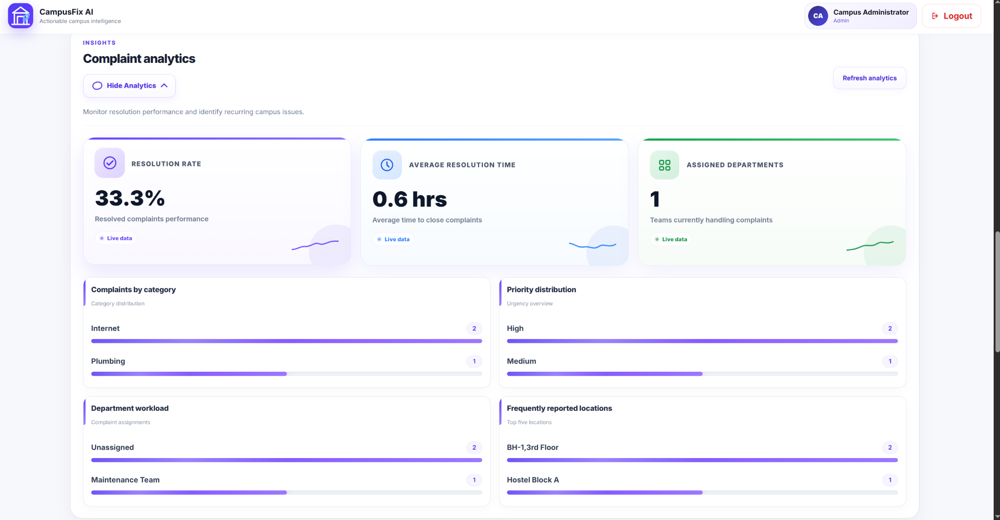
</p>


### Feedback Overview
<p align="center">
  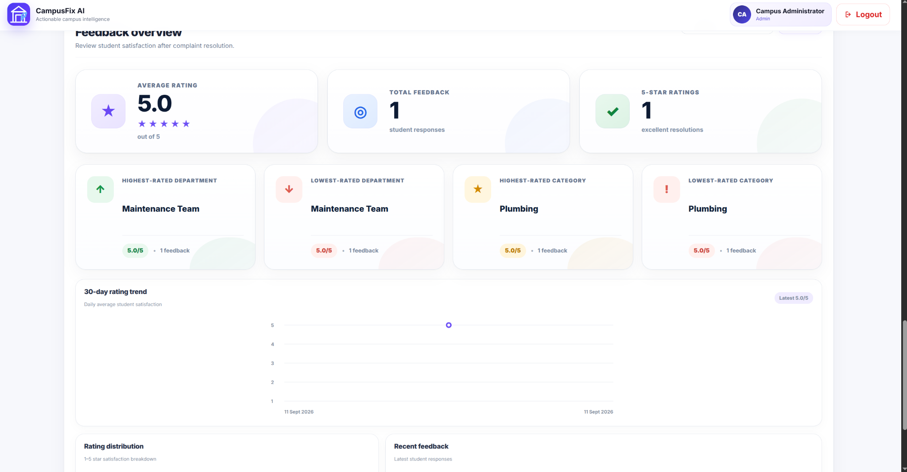
</p>

---

# AI-Powered Features

## AI Complaint Analysis

<p align="center">
  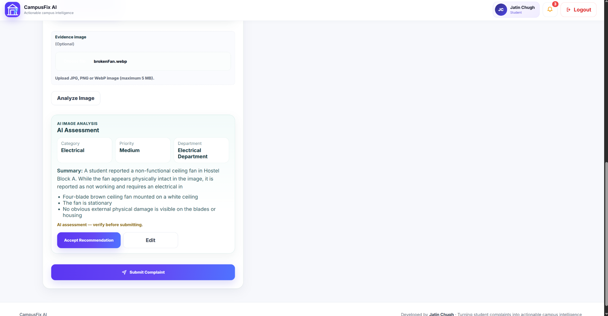
</p>

Gemini analyzes a student's complaint before submission and provides recommendations for:

- Category
- Priority
- Department
- Complaint summary
- Recommended action

Students can review the AI recommendation and accept it before submitting the complaint.

---

## AI Image Analysis

<p align="center">
  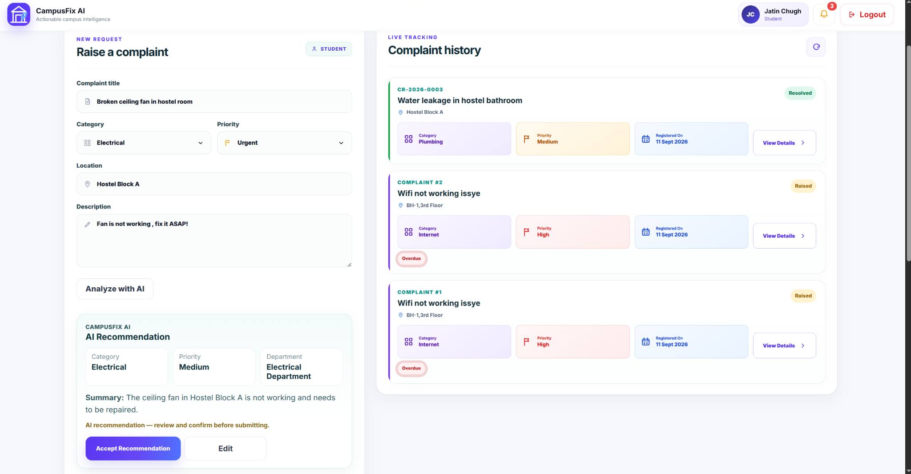
</p>

Gemini can analyze uploaded evidence images to identify visible issues and provide recommendations for:

- Category
- Priority
- Department
- Complaint summary
- Recommended action

This helps convert visual evidence into structured complaint information.

---

## AI-Assisted Complaint Submission

<p align="center">
  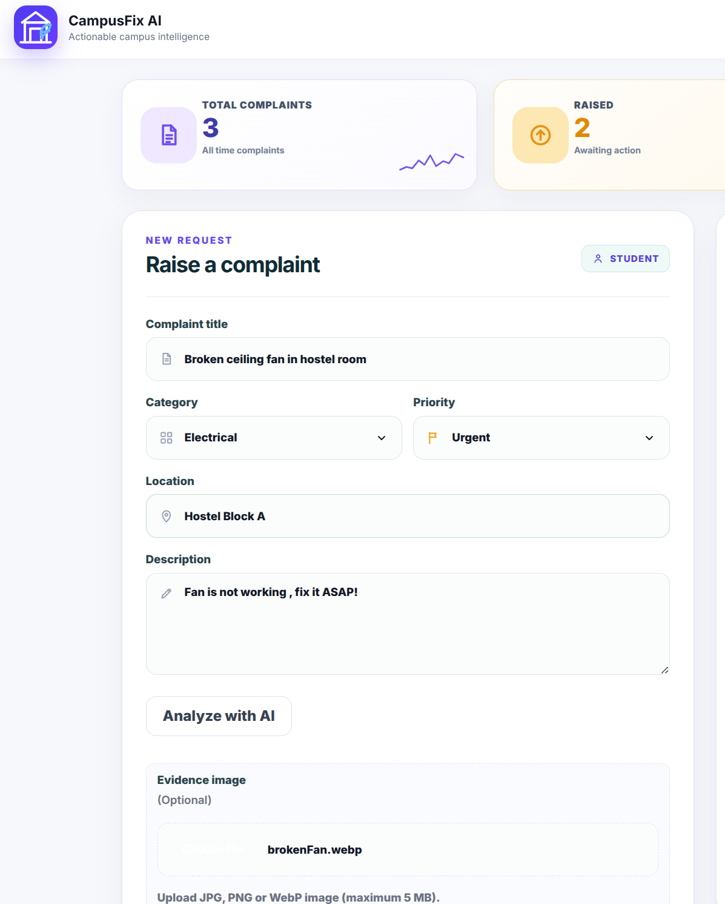
</p>

Students can use AI assistance while preparing a complaint. The system helps transform an unstructured description into a clearer and more actionable complaint before it is submitted.

---

## Similar Complaint Detection

The platform compares a new complaint against existing complaints to identify potentially similar or duplicate open issues.

This helps students and administrators recognize recurring problems and avoid treating the same campus issue as completely separate complaints.

---

## AI Issue Clustering

<p align="center">
  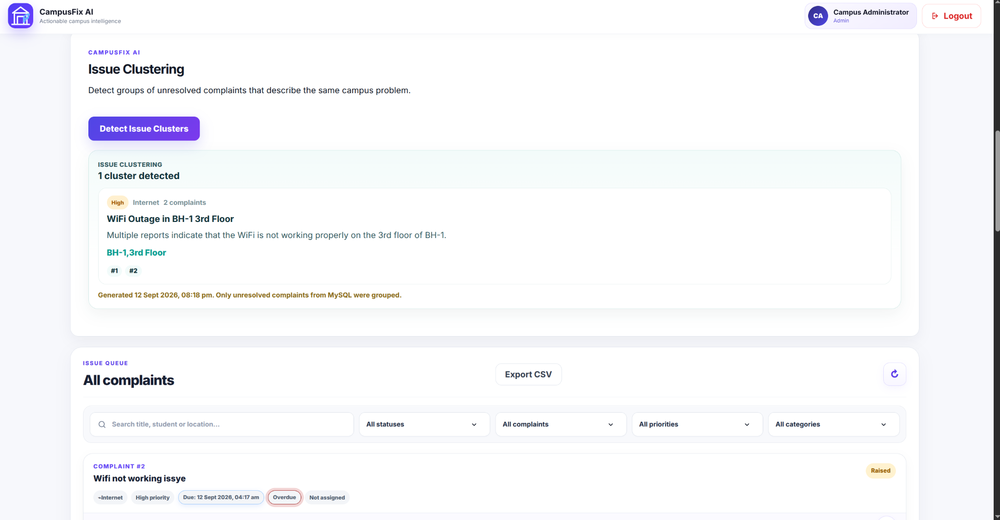
</p>

AI Issue Clustering groups related unresolved complaints into broader issue clusters based on their content and context.

This helps administrators identify recurring problems that may require coordinated action rather than handling every complaint independently.

---

## AI Campus Insights

<p align="center">
  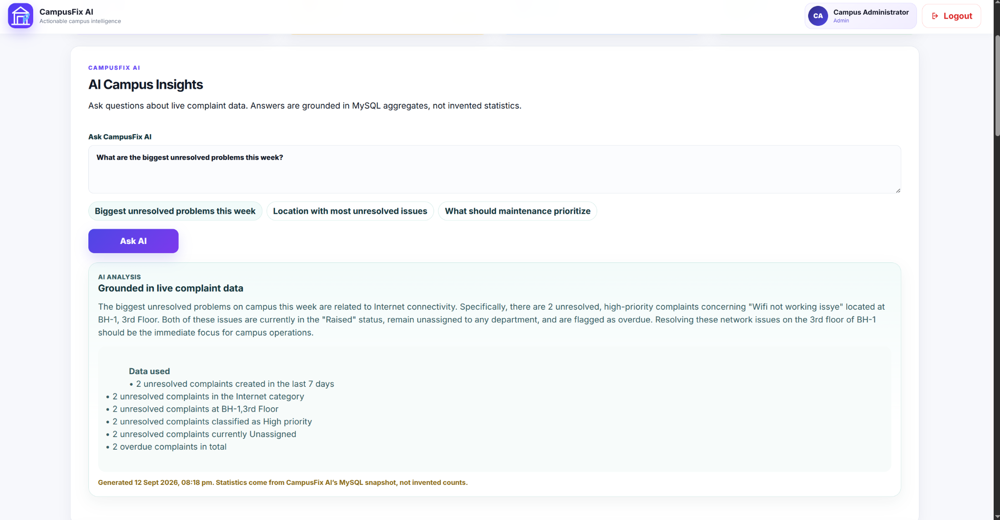
</p>

AI Campus Insights allows administrators to ask questions about current campus complaints using natural language.

The AI responses are grounded in live database aggregates, allowing administrators to understand patterns such as:

- Number of unresolved complaints
- Complaint categories
- Priority distribution
- Frequently affected locations
- Unassigned complaints
- Areas requiring administrative attention

---

---

## Core Features

### Student Portal

- Secure registration and login
- Raise complaints with:
  - Title
  - Category
  - Priority
  - Location
  - Description
  - Optional evidence image
- View personal complaint history
- Track complaint status and expected resolution
- Edit or delete eligible complaints
- View administrator updates
- Receive notifications
- Submit ratings and feedback after resolution
- Recover account using OTP-based password reset
- Analyze a complaint with Gemini before submitting
- Optional evidence image analysis
- See possible similar open complaints

### Admin Portal

- Dedicated administration dashboard
- View all complaints in a centralized queue
- Search and filter complaints by multiple criteria
- Assign or reassign complaints to departments
- Update complaint status
- Add administrator notes
- Track due dates, overdue complaints, and escalation levels
- View complaint activity history
- Export complaint data
- View complaint analytics
- Review student feedback and satisfaction insights
- Ask CampusFix AI questions about live complaint statistics
- Group related unresolved complaints using AI Issue Clustering

---

## Tech Stack

| Layer | Technology |
|---|---|
| Frontend | HTML5, CSS3, JavaScript |
| Backend | Node.js, Express.js |
| Database | MySQL |
| Authentication | JWT |
| Password Security | bcryptjs |
| Validation | express-validator |
| Security Headers | Helmet |
| Rate Limiting | express-rate-limit |
| File Uploads | Multer |
| Email / OTP | Brevo API |
| AI | Google Gemini API |
| Database Driver | mysql2 |

---

## Security

CampusFix AI includes multiple security-focused measures:

- Password hashing with bcryptjs
- JWT-based authentication
- Role-based authorization
- Request payload validation
- API rate limiting
- Helmet security headers
- Configurable CORS policy
- Restricted evidence upload types and sizes
- Safer generated upload filenames
- Protected upload serving
- OTP expiration and attempt limits
- Environment-variable based secret management
- `.env` excluded through `.gitignore`

---

## Complaint Workflow

```text
Student raises complaint
        ↓
Complaint enters admin queue
        ↓
Admin reviews and assigns department
        ↓
Status updated to In Progress
        ↓
Administrator adds resolution updates
        ↓
Complaint marked Resolved
        ↓
Student submits rating / feedback

---

## Project Structure

```text
CampusFix-AI/
├── ai/
├── config/
├── controllers/
├── middleware/
├── public/
│   ├── css/
│   └── js/
├── routes/
├── screenshots/
├── utils/
├── server.js
├── package.json
├── package-lock.json
└── README.md
```

---

## Getting Started

### 1. Clone the repository

```bash
git clone https://github.com/JatinChugh05/CampusFix-AI.git
cd CampusFix-AI
```

### 2. Install dependencies

```bash
npm install
```

### 3. Configure environment variables

Create a `.env` file in the project root:

```env
PORT=5000
NODE_ENV=development

DB_HOST=localhost
DB_USER=your_database_user
DB_PASSWORD=your_database_password
DB_NAME=your_database_name

JWT_SECRET=your_secure_jwt_secret

ADMIN_NAME=Campus Administrator
ADMIN_EMAIL=your_admin_email
ADMIN_PASSWORD=your_admin_password

BREVO_API_KEY=your_brevo_api_key
BREVO_SENDER_EMAIL=your_verified_sender_email
BREVO_SENDER_NAME=CampusFix AI

GEMINI_API_KEY=your_gemini_api_key
GEMINI_MODEL=gemini-3.5-flash
```

Get a Gemini key from Google AI Studio. The frontend never calls Gemini directly.

You can also copy `.env.example` and fill in the values.

### 4. Prepare the MySQL database

Create the required MySQL database and tables using the project schema before starting the server.

### 5. Start the application

```bash
npm start
```

Open:

```text
http://localhost:5000
```

---

## API Areas

The backend is organized around:

```text
/api/auth
/api/complaints
/api/notifications
/api/ai
/api/health
```

CampusFix AI endpoints (JWT required):

```text
POST /api/ai/analyze-text          student
POST /api/ai/analyze-image         student
POST /api/ai/similar-complaints    student
POST /api/ai/insights              admin
POST /api/ai/cluster-issues        admin
```

Authentication and role permissions are enforced on protected routes.

---

## Email Testing Note

The current Brevo testing configuration can send test emails only to addresses allowed by the Brevo account.

Gemini features require `GEMINI_API_KEY`. If the key is missing or Gemini is down, students and admins can still use the original complaint workflow.

---

## Future Improvements

- Verified custom email domain
- Department-specific administrator accounts
- Real-time notifications
- Advanced reporting and downloadable reports
- Mobile application
- Additional audit and monitoring tools

---

## Live Demo

**Deployed Application:**  
https://campusfix-ai-production.up.railway.app

## Repository

**GitHub:**  
https://github.com/JatinChugh05/CampusFix-AI

---

## Author

**Jatin Chugh**

GitHub: https://github.com/JatinChugh05

---


<p align="center">
  Built as a practical full-stack project focused on secure complaint tracking, AI-assisted analysis, administration, and campus issue resolution.
</p>
